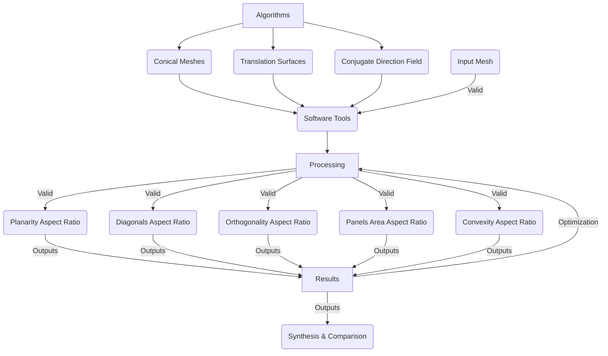

# Process Diagram

```mermaid
graph TD;
    Algorithms-->ConicalMeshes(Conical Meshes);
    Algorithms-->CDF(Conjugate Direction Field);
    Algorithms-->TranslationalSurfaces(Translation Surfaces);
    ConicalMeshes(Conical Meshes)-->SoftwareTools(Software Tools);
    TranslationalSurfaces(Translation Surfaces)-->SoftwareTools(Software Tools);
    CDF(Conjugate Direction Field)-->SoftwareTools(Software Tools);
    InputMesh(Input Mesh)-->|Valid|SoftwareTools(Software Tools);
    
    SoftwareTools(Software Tools)-->Processing;

    Processing-->|Valid|PlanarityAspectRatio(Planarity Aspect Ratio);
    Processing-->|Valid|DiagonalsAspectRatio(Diagonals Aspect Ratio);
    Processing-->|Valid|OrthogonalityAspectRatio(Orthogonality Aspect Ratio);
    Processing-->|Valid|PanelsAreaAspectRatio(Panels Area Aspect Ratio);
    Processing-->|Valid|Convexity(Convexity Aspect Ratio);
    
    Results-->|Optimization|Processing;
    PlanarityAspectRatio(Planarity Aspect Ratio)-->|Outputs|Results;
    
    DiagonalsAspectRatio(Diagonals Aspect Ratio)-->|Outputs|Results;
    
    OrthogonalityAspectRatio(Orthogonality Aspect Ratio)-->|Outputs|Results;
    
    PanelsAreaAspectRatio(Panels Area Aspect Ratio)-->|Outputs|Results;

    Results-->|Outputs|AnalysisComp(Synthesis & Comparison);

    Convexity(Convexity Aspect Ratio)-->|Outputs|Results;
    
```