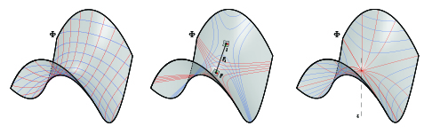
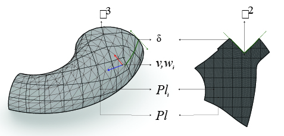
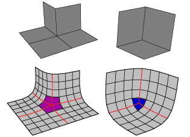
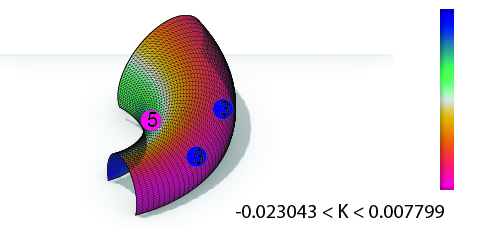

# Introduction

Planer Quad meshes have been nearly ubiquitous in architecture and construction. A large body of data structures and geometry processing algorithms based on them has been developed in the literature and adapted in construction of free-form surfaces. This type of re-meshing has many advantages especially the semi-regular ones, and significant progresses were made in quadrilateral mesh generation and processing during the last years. In this paper, we will study four algorithms behind planar quad meshes and their goals in order to fulfill the objectives. We will apply them on four input surfaces having different curvatures.

# Construction

In construction, planar quads should always be planar and their distribution on the mesh is preferably equidistant so that their size does not vary a lot. In the first section, the geometric properties of PQ meshes are introduced as well as their benefits over other ones. Therefore, the metrics and Figure_3 are split by type and explained graphically and mathematically.

## PQ Geometric Properties

![The hinge is affected by the high Gaussian curvature on the surface of the *Yas Island Hotel By Zaha Hadid* [@de2011technique]. The difference between *PQ meshes* and *triangle meshes*.](MT_JPG/Figure_1.jpg){#fig:Figure_1}	

A polygon face is planar if and only if its vertices $v_{n}$ *define a plane*. A triangle face is always planar, however a quadrangular face can be non-planar since the curvature plays a prominent role against the geometric property of a planar quad. Such constraint is a disadvantage for *PQ meshes* over triangular ones. Thus, if the warping height exceeds a certain limit while measuring it, the four vertices of each of the faces should be independent from its neighboring face's vertex see [@fig:Figure_1].

Knowing that two parallel vectors in space, enclosed at each point by two other vectors that are not necessarily parallel, form a planar face [@glymph2004parametric]. We Consider each row of faces $f_{i,j}$ is a *PQ strip*. The latter is composed by vertices $\mathbf{v}_{i,j}$ with a valence  $\pm k/4 (k\in Z)$ where along each vertex a curve of family A and a curve of family B intersect see [@liu2006geometric]. N-geons can appear with a valence $k \neq 4$ so called singularities see [@fig:Figure_2]. 

{#fig:Figure_2}

## Benefits

*Planar quad meshes* may be preferred over *triangular meshes* for construction reasons. In addition, planar quads  have the same fabrication and assembling benefits as triangles. The advantages of planar quads meshes for construction over other meshes is that:
*PQ meshes* have higher surface to edge ratio than triangles, thus, a lower mullion cost.
*PQ meshes* consumes less energy during fabrication.

## Metrics-Figure_3(Quality)

To have *planar quads*, several Figure_3 are mentioned below. For a better quality, the mathematical Figure_3 and the conditions are classified by face and by mesh[@fig:Figure_3 and @fig:Figure_4}. In addition to that, some conditions are translated to *custom goals* that improve the quality of the mesh. 

The measurements and conditions applied to the mesh itself are:

{#fig:Figure_3}

The measurements and conditions applied to the elements of the mesh are:

{#fig:Figure_4}

# Algorithmic Strategies

{#fig:Figure_5}

## Several Pre-Processing Techniques

Given four different meshes as inputs, several pre-processing techniques will be adapted in order to generate a *PQ mesh* with *planar faces*. The used techniques will depend on the surface type. Translation surfaces is an easy and fast algorithm to generate specific surfaces. However architecture free-form surfaces with high curvature require more complex algorithms to generate *PQ meshes* see [@fig:Figure_5].

### Translation Surfaces

Translation surfaces are limited and easy to generate. The quads generated are the proof that it is generated through a set of parallel vectors that result in a planar face. In addition to that they are homogeneous because adding the same length vector as a constraint leads to have evenly spaces faces and reduce the variance. If the sectional curves are plane and the vectors are parallel having the same length the result will respond to the design principle of a translation surface. Assuming that one direction of the quad mesh net to be the sectional curve, two design principles can appear:

* The row of longitudinal sectional curves form parallel vectors.
* The row of lateral sectional curves form parallel vectors.

#### Row of sectional curves translated over a set of parallel vectors

The family of sectional curves $p(\mathbf{u})$ translated over a set of parallel vectors is generated as follows: A random spatial curve $p(\mathbf{v})$ called generatrix is translated against another random spatial curve $p({\mathbf{u})}$ called directrix as seen in [@fig:Figure_6]. A translation by equal length gives homogeneous results of the planar quads.

{#fig:Figure_6}

Several geometrical shapes have been developed in architecture during the history using translation surfaces. The elliptical paraboloid is the most familiar shape found in architecture. It is generated using the same principle, translating one parabolic curve against another.

{#fig:Figure_7}

In transition surfaces, some geometrical shapes admit boolean and joining operations, for example, the hyperbolic paraboloid is a type of translation surface that acknowledge such operations. By translating a parabolic curve over a hyperbolic the result is as seen in [@fig:Figure_8]

{#fig:Figure_8}

#### Scale-Translation Surfaces

{#fig:Figure_9}

Scale Translation surfaces are generated by adding a scale parameter to the output curves $C_{n}$. After translating the sectional curve $p(u)$ on each point $v_{i}$ equally distant from the directrix curve $p(v)$ , the output curves can be scaled uniformly or non-uniformly controlled by the user. 
The central expansion of any curve gives a new curve having parallel edges. The center of expansion can be chosen randomly [@glymph2004parametric]. In this technique the centric expansion has been chosen. The resulting algorithm give planar quad meshes see [@fig:Figure_9].

### *Conjugate networks*

Some curve networks are a robust and efficient method to extract *PQ meshes* [@liu2006geometric]. Such method admits a huge variety of free-form surfaces. The advantage of designing a conjugate direction field is that the user possesses total freedom in controlling the PQ mesh layout [@zadravec2010designing]. Thus, the panels are flat and discretize the principal curvature lines see [@liu2006geometric].

![Left: High twisting moment. Middle: Stiffening by triangulation. Right: Torsion free alignment.[@zadravec2010designing]](MT_JPG/Figure_10.png){#fig:Figure_10}

In addition to that, it can admit free torsion node while aligning the curve networks with the stress and curvature field see [@fig:Figure_10] for more information on statics sensitive layout [@schiftner2010statics].

#### The relation between PQ meshes and *conjugate networks*.

{#fig:Figure_11}

As seen in [@fig: Figure_11], conjugate curve networks are families of curves $A, B\subset\Phi$:
For each $p\in\Phi$ unique curves of both family $A, B$ should appear. *Since $T_{1},T_{2}$ are conjugate then they pre-define $A$ and get $B$ by integrating the vector field directions conjugate of family $A$*.[@liu2006geometric]

*Examples of Conjugate Curve Networks on Surfaces*:

* Suited for PQ meshes: [@liu2006geometric]

    * *The network of principle curvature lines* see (@fig:Figure_13).
    * In a translation surface of the form $p(u,v)$ $\mathbf{p}(u)$ a sectional curve is translated along another curve generatrix $\mathbf{p}(v)$ and vice versa see @fig:Figure_6.

* Less suited for PQ meshes:
    * *Epipolar curves*: The translation of a point $p$ along a line $l$ and the intersection of the planes through the points $p(i)$ with that surface $\Phi$ generates asymptotic curves that are not suited for such meshing see (@fig:Figure_13).
    * *Isophotic curves are conjugate to the system of the steepest descent curves respecting the z-axis* see (@fig:Figure_13).

{#fig:Figure_13}

#### What is a CDF on a *triangular mesh*.

On a smooth surface  $S \subset {\mathbb R}{^3},$ the tangent vectors $\mathbf{v}{_p},\mathbf{w}{_p}$ are conjugate if and only if they are treated as two vectors in ${\mathbb R}{^3}$ [@liu2011general]. The CDF is a tool for non-photorealistic rendering in order to visualize the surface topology. Therefore it is useful for surface re-meshing and alignment control. On a triangular face $f{_i}$ as seen in [@fig:Figure_12] of a triangular mesh ${\mathbb R}{^3}=(V,E,F)$ a CDF is:

![A CDF on a Triangular face based on [@liu2011general].](MT_JPG\Figure_12.jpg){#fig:Figure_12}

* Four vectors {$\mathbf{{v}_{i},{w}_{i}.{-v}_{i}{-w}_{i}}$}
* Two scalar parameters {$\theta_{i},\alpha_{i}$}:
    * $\theta_{i}$ oriented angle between $e_{i,1}$ and $\mathbf{v_{i}}$
    * $\alpha_{i}$ oriented angle between $\mathbf{v_{i}}$ and $\mathbf{w_{i}}$
    * They define the following: $\mathbf{{v_{i}}=(cos\theta_{i},sin\theta_{i})}{^T}$ and $\mathbf{w_{i}=(cos(\theta_{i}+\alpha_{i}),sin(\theta_{i}+\alpha_{i})}{^T}$

#### Generating quad-dominant meshes via conjugate direction field

When the input is a mesh and not a surface, it is preferable to imply isotropic re-meshing. In this case, the re-meshing tool mesh machine is used [@MeshMachine]. After re-meshing the given input meshes $\mathbb{R}^{3}$, the conjugate direction field $[\mathbf{v_{i},w_{i}}]$ is particularly generated using a custom plugin called [@Capybara] developed by [@mueller2018optimized]. The candidate *PQ mesh* is generated after applying the global parametrization using frame fields and tracing the streamlines.

##### Alignment with the curvature [@mueller2018optimized].

{#fig:Figure_14}

The quality of the mesh is always better when the panels are aligned with the curvature or the stress lines. Given four different meshes $\mathbb{R}^{3}$, the orthogonality is introduced for each of the meshes $\mathbb{R}^{3}_{i}$ by computing the *principle directions* $e_{1}$, $e_{2}$ and storing them in $[e_{1},e_{2}]$ see @fig:Figure_14. This method has been used by [@liu2011general].

##### Interpolating vector field with *N-PolyVector Field* [@mueller2018optimized].

{#fig:Figure_15}

In [@fig:Figure_15], it is clear that the smoothed vector field and the parallel transport have been well generated. In order to find a smooth and aligned vector field $[e_{1},e_{2}]$ on each of the four meshes $\mathbb{R}^{3}$, the algorithm is based on finding the trade-off between neighboring faces $f_{i}$ so that the parallel transport succeeds see [@fig:Figure_12] right. It uses the novel method proposed by [@diamanti2014designing] called *N-Poly Vector Field*. While selecting a subset of points [P], the vector field $[e_{1},e_{2}]$ is able to be generated smoothly and continuously. It finds the smoothest field by interpolating the two vectors parallelly. This method is different from the one used in [@liu2011general] where a signed permutation method is used in order to find the correct relation between neighboring vectors.

##### *Conjugate direction field*

![Conjugate field $[\mathbf{v_{i},w_{i}}]$ after smoothing previously the vector field $[e_{i,1}, e_{i,2}]$.](MT_JPG/Figure_16.jpg){#fig:Figure_16}

After smoothing the vector field in the previous step, a quad mesh can be computed after generating the conjugate networks [@liu2011general]. From the previous step a conjugate vector field $[\mathbf{v_{i},w_{i}}]$ is computed using an algorithm provided in [@LibDirectional] see [@fig:Figure_16].

##### Global parametrization using frame fields

{#fig:Figure_17}

If the mesh possess negative curvature, the parametrization has to be done by patches, see @fig:Figure_17 otherwise the parametrization can be done on a single patch see @fig:Figure_18. The algorithm succeeds on all the meshes except for the last one $\mathbb{R}^{3}_{4}$ where collisions appear. The global parameterization using frame fields [@fig:Figure_17] is computed at the index *i* to shape the new mesh in a 2D topology. For each of the given 3D meshes, align the topology with the given vector fields $[e_{1},e_{2}]$ at index *i*. Therefore, such field can be easily manipulated by the user.

##### Tracing streamlines

The streamlines [$Pl_{i}$] are traced on the 2D maps after integrating the Vector field $[e_{1},e_{2}]$ then they are remapped on the 3D meshes $\mathbb{R}^{3}$. This method is based on the 4th order Runge-Kutta [@mueller2018optimized], see [@fig:Figure_17].

##### Extracting the candidate PQ Meshes

{#fig:Figure_18}

Given the conjugate filed $[\mathbf{v_{i},w_{i}}]$ and the streamlines $Pl_{i}$, the meshes $\mathbb{R}^{3}$ are generated by retrieving the faces $f_{i}$ with the same vertex valence [@fig:Figure_18]. Nevertheless, the resulting meshes are not totally planar and require a further optimization.

#### Generating  quad-dominant meshes via principle curvature networks

This method is different from the previous one. The network of curves $[Pl]$ will be generated on each of the four meshes $\mathbb{R}^{3}_{i}$ using a plugin called [@Millipede], however the output is not sorted. Although, without a special library like [@libigl] and [@ebke2013qex] to automatically extract a robust-quad mesh is very hard to achieve. This method is based on the on the mixed-integer quadrangulation by [@bommes2009mixed]. Therefore, in this research an algorithm had to be developed in order to extract that candidate PQ mesh using conformal mapping.

##### Computing curvature networks

![Curve network $Pl_{i}$ computed using [@Millipede] on each of the input meshes $\mathbb{R}^3_{i}$.](MT_JPG/Figure_19.jpg){#fig:Figure_19}

The *principle curvature networks* $[Pl]$ are generated automatically by reparametrizing the input meshes $\mathbb{R}^3_{i}$ see [@fig:Figure_19].

##### Global parametrization using conformal mapping

{#fig:Figure_20}

*The curve networks* $[Pl]$ previously computed, are reparametrized using conformal mapping. Then they are analyzed and rebuilt in order to close naked nodes and form meshes with a semi-regular valence.

##### Extracting the candidate PQ meshes

{#fig:Figure_21}

After mapping the *curve networks* and rebuilding the quad mesh on the unit plane, it is now possible to remap the meshes on input meshes $\mathbb{R}^3_{i}$ see  [@fig:Figure_21].

### Conical meshes

![Left: Offset property of a conical mesh. Right: *Railway station by B.Schneider* [@liu2006geometric] a conical mesh as glass structure that *discretizes the principle curvature*.](MT_JPG/Figure_22.jpg){#fig:Figure_22}

Conical meshes are planar quad meshes which *discretize principle curvature lines*, possess an offset at a constant distance as well as planar connecting elements [@liu2006geometric] see [@fig:Figure_22]. A conical mesh is conical if and only if all of its vertices $\mathbf{v}_{i}$ are conical which means that the four faces meeting at the vertex $\mathbf{v}$ are tangent to a common sphere [@liu2006geometric] see [@fig:Figure_23].

#### The angle criterion of a conical mesh 

![Faces configuration of a conical mesh [@liu2006geometric].](MT_JPG/Figure_24.jpg){#fig:Figure_24}

Assuming that the sum of the opposite angles on a vertex $\mathbf{v}$ should always be equal to zero, see [@fig:Figure_24], $\mathbf{v}$ is a conical vertex if and only if the characterization of a conical mesh interior angles respond to this function: $$\omega_{1}+\omega_{3}=\omega_{2}+\omega_{4}$$

#### The Offset Properties

![Constant offset of a Conical Mesh see [@pottmann-2008-fg].](MT_JPG/Figure_23.jpg){#fig:Figure_23}

Triangular meshes are missing the offset property at a constant distance, while conical meshes answer to this property [@liu2006geometric]. The faces of a conical mesh are incident to a common vertex $\mathbf{v}_{i,j}$ and tangent to a cone with an axis $Q_{i,j}$. After offsetting, the axis remains the same and the faces are still tangent to the cone [@liu2006geometric]. The Languerre transformation [@liu2006geometric] contains one of the instances for offsetting planes by a fixed distance along their normal vector. The Languerre transformation preserves the conical meshes at the offset.

#### The Normals

*The spherical image* is a fact where the vertices $\mathbf{v}_{ij}$ of a PQ mesh built on a unit sphere are converted to the normal vectors of $Q_{i,j}$. As the four faces incident to a common vertex $\mathbf{v}_{ij}$ tangent to the same cone see [@fig:Figure_24], the normal vectors ${n_{i,j}}$ on each of the four faces share the same angle  with the cone's axis $Q_{i,j}$ see @fig:Figure_23. Consequently, the spherical image of the principle curvature network returns an orthogonal curve network on a sphere  [@liu2006geometric].

#### Conical optimization

PQ meshes generated after computing the principle curve networks are well suited to be optimized using conical meshes conditions. In order to do that, the angles and normals are measured and visualized with a gradient color that varies in a range between the common meshes see @fig:Figure_25 and @fig:Figure_26.

##### Angles and normals analysis

Left: The sum of the opposite angles $\omega_{i}$ measured in radians for each vertex $\mathbf{v}_{i,j}$ of the meshes $\mathbb{R}^3_{i}$. Right:  The angles difference $\theta_{i}$ between the normals $n_{i,j}$ and the cones normal $Q_{i,j}$ are measured in radians for each vertex $\mathbf{v}_{i,j}$ of the meshes $\mathbb{R}^3_{i}$.

{#fig:Figure_25}

##### Angles and normals optimization

For each vertex $\mathbf{v}_{i,j}$ on the mesh $\mathbb{R}^3$ minimize the sum of the opposite angles equals to zero $\omega_{1}+\omega_{3}-\omega_{2}-\omega_{4}=0$ using [@Kangaroo3d] solver.

{#fig:Figure_26}

## Optimization (K2)goals

#### Analysis

In order to optimize the panels, the planarity $\delta_{PQ}$ is measured in radians, diagonals aspect ratio $\eta_{PQ}$ and the warping height $h$ are measured in cm, and finally the area $\eta_{PQ}$ and the variance are measured in $cm^2$ on the the meshes generated via conjugate curve networks as seen in [@fig:Figure_27 and @fig:Figure_28].

{#fig:Figure_27}
{#fig:Figure_28}

#### Optimization

After analyzing the panels under their required goals for them to be planar, the elements are optimized using kangaroo2 solver [@Kangaroo3d]. The results have been reduced noticeably see in [@fig:Figure_29 and @fig:Figure_30].

{#fig:Figure_29}
{#fig:Figure_30}

## Subdivision Strategy (Starting with a Coarse Quad-Dominant mesh)

### Subdivision Strategy principles

{#fig:Figure_31}

A coarse mesh that approximates the topology of a input surface can be subdivided using the catmull-clark algorithm [@Weaverbird]. For PQ meshes, the valence of the each vertex should be four, vertices with a valence more then four are considered as singularities. After applying the subdivision on the coarse mesh, singularities with negative indices take a negative curvature and singularities with a positive indices take a positive curvature see [@fig:Figure_31].

### Curvature and singularities analysis

{#fig:Figure_32}

On the given input meshes, the curvature $K$ is analyzed and the singularities are placed by index see [@fig:Figure_32].

### Generating the coarse mesh

{#fig:Figure_33}

Subsequently to the previous step, a 2D map by patches is generated. Such a method can help out predicting the pre-networking between singularities and avoiding unexpected ones. Therefore it is now possible to generate the coarse mesh following the 2D map see [@fig:Figure_33].

### Catmull-clark subdivision and pull to mesh

{#fig:Figure_34}

The catmull-clark algorithm is applied to the coarse meshes. Using kangaroo2 [@Kangaroo3d] the coarse mesh is pulled by constraining the latter's points on the input meshes. The returning outputs are the candidate *PQ meshes* that need iterative optimization [@fig:Figure_34].

### Analysis

After analyzing the panels under their required goals for them to be planar, the elements are optimized using kangaroo2 solver [@Kangaroo3d]. The results have been reduced noticeably see in [@fig:Figure_34 and @fig:Figure_35].

{#fig:Figure_35}
{#fig:Figure_36}

## Comparison & Synthesis

{#fig:Figure_37}
{#fig:Figure_38}

# Conclusion
*PQ meshes* must show different results from mere geometry. The planarity of the faces should obey the goals in order to fulfil the basis of the *planar quad meshes* [@zadravec2010designing]. They are very hard to deal with when the input surface is a free-form. However some algorithms have shown the differences between them and their results. Having a conjugate direction field as a tool to control the mesh layout is very useful. Thus, generating PQ meshes from curve network is strongly accurate. The two different methods are almost planar after generation since they are extracted from the principal directions. The conical optimization has proven its effectiveness over planar quad meshes. By optimizing and combining the methods, the last one was to generate planar quads by subdividing a coarse mesh and then optimizing it to planar. The boundary condition has been neglected in these methods, however, we recommend the first method due to its smooth results and its manipulation liability.

# Further work

For further research the boundary will be taken in consideration while generating the PQ meshes. The fourth mesh $\mathbb{R}^3_{4}$ that failed in the frame field algorithm has to be developped accordingly to its curvature for it to unwrap while avoiding collisions.
