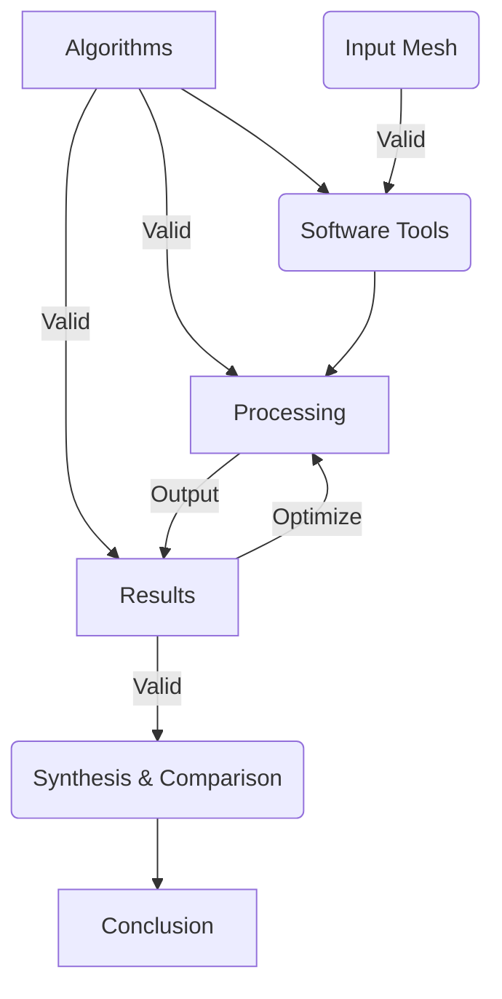

# Process Diagram

```mermaid
graph TD;
    Algorithms-->SoftwareTools(Software Tools);

    Algorithms-->|Valid|Processing;

    Algorithms-->|Valid|Results;

    InputMesh(Input Mesh)-->|Valid|SoftwareTools(Software Tools);
    
    SoftwareTools(Software Tools)-->Processing;

    Processing-->|Output|Results;

    Results-->|Optimize|Processing;

    Results-->|Valid|Synthesis(Synthesis & Comparison);

    Synthesis(Synthesis & Comparison)-->Conclusion;
    
```