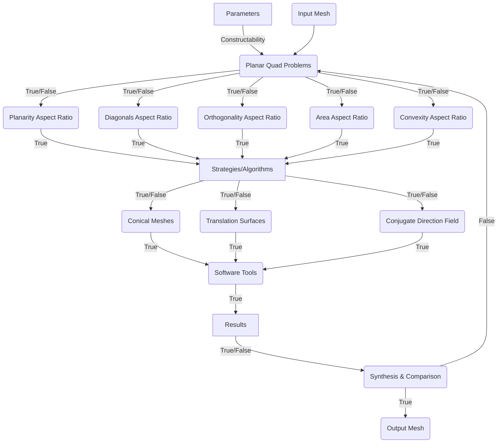

# Process Diagram

```mermaid
graph TD;

Parameters-->|Constructability|PlanarQuad(Planar Quad Problems);

InputMesh(Input Mesh)-->PlanarQuad(Planar Quad Problems);

PlanarQuad(Planar Quad Problems)-->|True/False|PlanarityAspectRatio(Planarity Aspect Ratio);
PlanarQuad(Planar Quad Problems)-->|True/False|DiagonalsAspectRatio(Diagonals Aspect Ratio);
PlanarQuad(Planar Quad Problems)-->|True/False|OrthogonalityAspectRatio(Orthogonality Aspect Ratio);
PlanarQuad(Planar Quad Problems)-->|True/False|PanelsAreaAspectRatio(Area Aspect Ratio);
PlanarQuad(Planar Quad Problems)-->|True/False|Convexity(Convexity Aspect Ratio);

PlanarityAspectRatio(Planarity Aspect Ratio)-->|True|Strategies/Algorithms;
DiagonalsAspectRatio(Diagonals Aspect Ratio)-->|True|Strategies/Algorithms;
OrthogonalityAspectRatio(Orthogonality Aspect Ratio)-->|True|Strategies/Algorithms;
PanelsAreaAspectRatio(Area Aspect Ratio)-->|True|Strategies/Algorithms;
Convexity(Convexity Aspect Ratio)-->|True|Strategies/Algorithms;

Strategies/Algorithms-->|True/False|ConicalMeshes(Conical Meshes);
Strategies/Algorithms-->|True/False|CDF(Conjugate Direction Field);
Strategies/Algorithms-->|True/False|TranslationalSurfaces(Translation Surfaces);
ConicalMeshes(Conical Meshes)-->|True|SoftwareTools(Software Tools);
TranslationalSurfaces(Translation Surfaces)-->|True|SoftwareTools(Software Tools);
CDF(Conjugate Direction Field)-->|True|SoftwareTools(Software Tools);


SoftwareTools(Software Tools)-->|True|Results;
Results-->|True/False|Synthesis(Synthesis & Comparison);
Synthesis(Synthesis & Comparison)-->|False|PlanarQuad(Planar Quad Problems);
Synthesis(Synthesis & Comparison)-->|True|Output(Output Mesh);

```